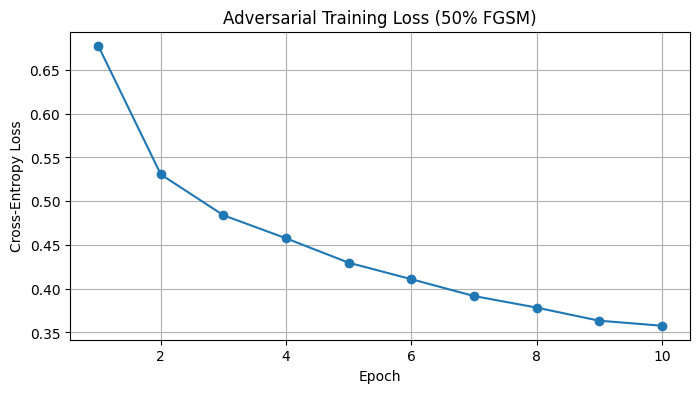
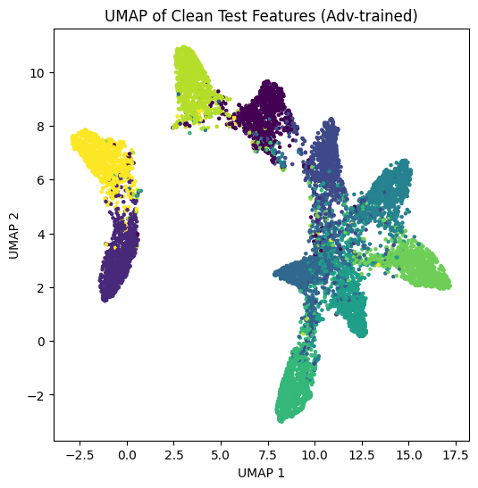
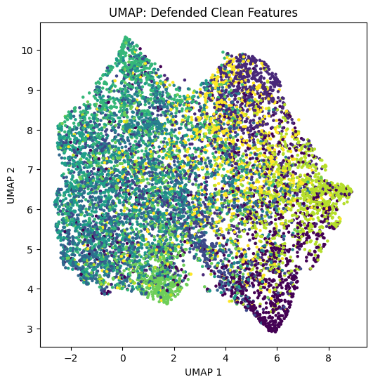

# Adversarial Defense Strategies on ResNet-20

This repository contains the implementation for the second part of the "Trustworthy AI" project. In this section, we tackle the challenge of adversarial vulnerability by employing various defense mechanisms to improve a pre-trained ResNet-20 model's robustness against FGSM and PGD attacks on the CIFAR-10 dataset.

## Project Objectives
- Evaluate basic defense mechanisms using Data Augmentation (color jitter, rotation, noise).
- Implement Adversarial Training by fine-tuning the model on FGSM-perturbed data.
- Investigate the representation space using Contrastive Learning (Circle Loss).
- Build and evaluate a Defense-VAE (Variational Autoencoder) to filter out adversarial noise from inputs.



## Dataset
This project uses the **CIFAR-10** dataset. For detailed information on how to set up the data, please refer to the `data/README.md` file.

## Key Results
The implementation of different defense strategies successfully improved the model's performance under adversarial conditions, especially against multi-step attacks like PGD ($\epsilon=0.03$, $\alpha=0.005$, steps=40).

- **Accuracy under PGD attack (Data Augmentation):** ~28.12%
- **Accuracy under PGD attack (Adversarial Training):** ~50.37%
- **Accuracy under PGD attack (Defense-VAE with fine-tuning):** ~48.80%

### Visualizing Feature Robustness (UMAP)
The UMAP plots below illustrate the penultimate-layer feature spaces of the model. Unlike standard models where adversarial attacks collapse class boundaries, Advanced defenses like Adversarial Training and Defense-VAE maintain distinct class clusters even after adversarial perturbations.

**Adversarial Training Feature Space:**


**Defense-VAE Feature Space:**


## Repository Structure
```text
.
├── assets/                     # UMAP plots, charts, and output samples
├── data/                       # CIFAR-10 dataset directory
│   └── README.md               # Dataset documentation
├── notebooks/
│   └── Q2_Adversarial_Defense.ipynb  # Main Jupyter notebook
├── Autoencoder_model.py        # VAE/Autoencoder architecture script
├── README.md                   # This file
└── requirements.txt            # Python dependencies
